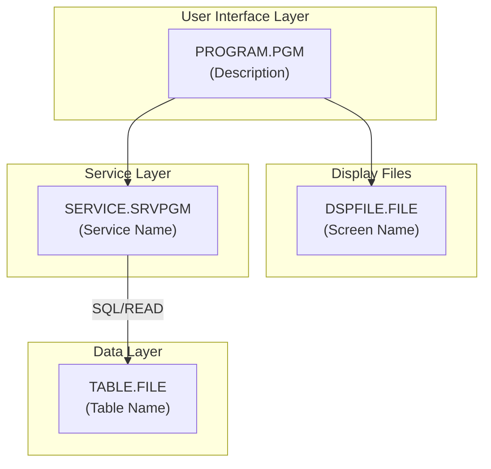
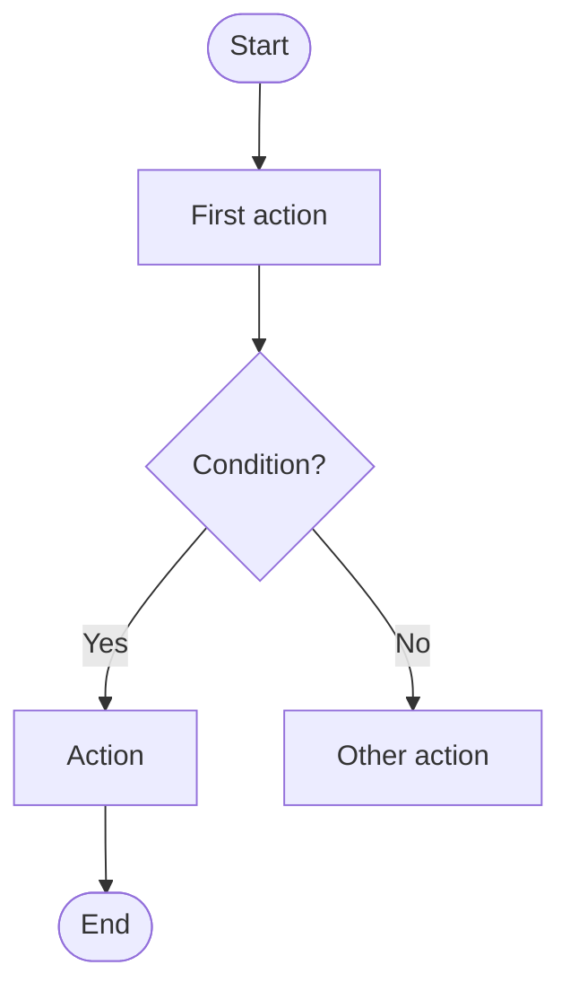

# Ibmi Program Documentation

Generate comprehensive documentation for IBM i programs including technical specifications, dependency analysis, visual diagrams, and user-friendly explanations.

## Output Requirements

**CRITICAL: Always create TWO separate markdown files for each program:**

1. **`<PROGRAM>_Technical_Documentation.md`** - Technical documentation for developers and system administrators
2. **`<PROGRAM>_User_Guide.md`** - Non-technical documentation for end users

Replace `<PROGRAM>` with the actual program name (e.g., `WRKCUST1R_Technical_Documentation.md`).

Both files must be created and saved to the output directory. Do not combine them into a single file.

---

## File 1: Technical Documentation

**Filename:** `<PROGRAM>_Technical_Documentation.md`

**Purpose:** Comprehensive technical reference for developers, system administrators, and support staff.

### Required Sections

#### 1. Overview
- Program name, type, source file path, and purpose
- Brief description of what the program does and its role in the application

#### 2. Technical Specifications

##### Control Options Table
| Option | Value | Description |
|--------|-------|-------------|
| DFTACTGRP | value | Default activation group setting |
| ACTGRP | value | Activation group |
| BNDDIR | value | Binding directories used |

##### Input Parameters Table
| Parameter | Data Type | Description |
|-----------|-----------|-------------|
| name | type | purpose |

##### Files Used Table
| File | Type | Description |
|------|------|-------------|
| name | WORKSTN/DISK/PRINTER | purpose |

##### Service Programs/Procedures Called Table
| Service Program | Procedure | Description |
|-----------------|-----------|-------------|
| name | procedure | purpose |

#### 3. Dependency Tree (Text Format)
```
PROGRAM.PGM
├── Source Files
│   ├── program.rpgle
│   └── copybook.rpgle (/COPY member)
├── Display Files
│   └── DSPFILE.FILE
├── Service Programs
│   └── SRVPGM.SRVPGM
├── Binding Directory
│   └── BNDDIR.BNDDIR
└── Database Tables
    └── TABLE.FILE
```

#### 4. Dependency Diagram (Mermaid)
Create a flowchart showing:
- User Interface Layer (menus, programs)
- Display Files
- Service Layer (service programs)
- Binding (binding directories)
- Data Layer (physical files/tables)
- Source Files (with compile relationships)

Use this template:


#### 5. Complete Object Dependency List
Create tables for each object type:
- Programs (*PGM)
- Service Programs (*SRVPGM)
- Modules (*MODULE)
- Display Files (*FILE DSPF)
- Physical Files (*FILE PF)
- Logical Files (*FILE LF)
- Binding Directories (*BNDDIR)
- Copy Members
- Export Definitions

#### 6. Database Schema
For each table used:
| Field | Type | Length | Description |
|-------|------|--------|-------------|
| name | Packed/Zoned/Char | size | purpose |

Include primary keys and relationships.

#### 7. Display File Layout
- ASCII representation of screen layout
- Field table with Name, Length, Type (Input/Output), Description
- Record format descriptions

#### 8. Program Flow (Mermaid)


#### 9. Indicators Used
| Indicator | Purpose |
|-----------|---------|
| *INxx | description |

#### 10. Error Handling
- List error conditions handled
- Describe error messages displayed
- Explain recovery procedures

#### 11. Build Dependencies
Show makefile or build rules:
```makefile
program.pgm: program.rpgle copybook.rpgle dspfile.file srvpgm.srvpgm | bnddir.bnddir
```

#### 12. Related Programs
| Program | Description | Relationship |
|---------|-------------|--------------|
| name | purpose | caller/callee/alternate |

#### 13. Version Information
| Attribute | Value |
|-----------|-------|
| Source Format | Free-format/Fixed-format RPG |
| ILE Compatible | Yes/No |
| Activation Group | value |
| Multi-threaded | Yes/No |

---

## File 2: User Documentation

**Filename:** `<PROGRAM>_User_Guide.md`

**Purpose:** Easy-to-understand guide for end users who interact with the program through screens or reports.

### Required Sections

#### 1. Introduction
- What is this program/screen? (1-2 sentences in plain language)
- What can you do with it?

#### 2. How to Access
Step-by-step navigation instructions:
1. From the main menu, select **Option X: Description**
2. Navigate to the next screen
3. Select the option to open this program
4. Include menu paths and option numbers

#### 3. Screen Layout
- Simple description of what appears on the screen
- Group related information (e.g., "Customer Information", "Financial Details", "Contact Information")
- Do NOT use technical field names - use descriptive labels

#### 4. Field Descriptions
For each field the user sees or enters:
- **Field Label:** What it shows/what to enter
- Use bullet points, not tables
- Explain codes in plain language (e.g., "Status: A = Active customer, I = Inactive customer")

#### 5. Function Keys
List available function keys with their actions:
- **F3=Exit:** Returns to the previous screen
- **F5=Refresh:** Updates the display with current data
- **F12=Cancel:** Cancels current action and returns

#### 6. How to Perform Common Tasks
Step-by-step instructions for typical tasks:
- How to view information
- How to add new records (if applicable)
- How to change existing records (if applicable)
- How to search or filter (if applicable)

#### 7. Understanding the Display
Explain what different values mean:
- Status codes explained
- Type codes explained
- Date formats explained
- Any color coding or highlighting

#### 8. Error Messages
List common errors in plain language:
| What You See | What It Means | What to Do |
|--------------|---------------|------------|
| "Record not found" | The item doesn't exist | Check the number and try again |

#### 9. Frequently Asked Questions
Anticipate user questions:
- **Q: Why can't I change the information?**
- A: This screen is for viewing only. To make changes, use [other program/option].

- **Q: What do the status codes mean?**
- A: [Explain each code]

#### 10. Tips and Best Practices
- Helpful hints for using the program effectively
- Common mistakes to avoid
- Shortcuts or time-savers

#### 11. Getting Help
- Who to contact for assistance
- Related documentation or training materials

### User Documentation Writing Guidelines

1. **Never use technical jargon** - No field names like CUSTNO, use "Customer Number"
2. **Write in second person** - "You can view..." not "The user can view..."
3. **Use simple sentences** - One idea per sentence
4. **Include visual cues** - Bold for menu options and function keys
5. **Explain everything** - Don't assume prior knowledge
6. **Be consistent** - Use the same terms throughout

---

## Analysis Process

### Step 1: Locate Source Files
1. Find the main program source (*.rpgle, *.sqlrpgle, *.clle)
2. Identify /COPY or /INCLUDE members
3. Find associated display file sources (*.dspf)
4. Locate physical file definitions (*.pf)

### Step 2: Extract Technical Details
From the source, identify:
- Control specifications (CTL-OPT or H-specs)
- File declarations (DCL-F or F-specs)
- Procedure calls (CALLP, external procedures)
- SQL statements (for SQLRPGLE)
- Data structures and variables

### Step 3: Trace Dependencies Recursively
For each dependency found:
1. Document the direct dependency
2. Analyze that object's source for its dependencies
3. Continue until all dependencies are mapped
4. Build the complete dependency tree

### Step 4: Analyze Display Files
From DSPF source:
- Extract record formats
- List all fields with attributes
- Identify function key assignments
- Note field-level validation

### Step 5: Document Database Access
- List all tables read/written
- Document field usage
- Identify key fields and access paths

### Step 6: Create Both Output Files
1. Write the Technical Documentation file first
2. Then create the User Guide, translating technical details into plain language
3. Save both files to the output directory
4. Present both files to the user

---

## Final Output Checklist

Before completing, verify:

### Technical Documentation File
- [ ] File created with correct name: `<PROGRAM>_Technical_Documentation.md`
- [ ] All 13 sections included
- [ ] Dependencies traced recursively
- [ ] Mermaid diagrams render correctly
- [ ] Tables properly formatted
- [ ] Build dependencies complete

### User Guide File
- [ ] File created with correct name: `<PROGRAM>_User_Guide.md`
- [ ] All 11 sections included
- [ ] No technical jargon used
- [ ] Function keys documented
- [ ] Error messages explained in plain language
- [ ] Step-by-step instructions included
- [ ] FAQ addresses common questions

### Final Steps
- [ ] Both files saved to output directory
- [ ] Both files presented to user